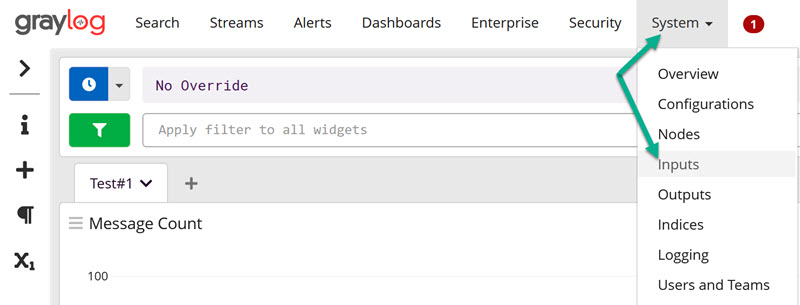
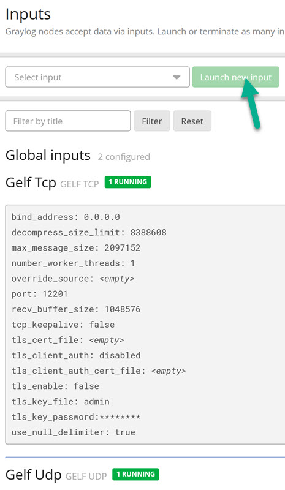
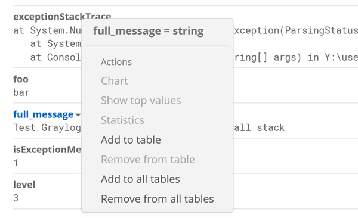
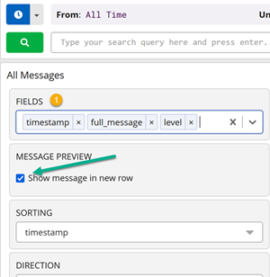
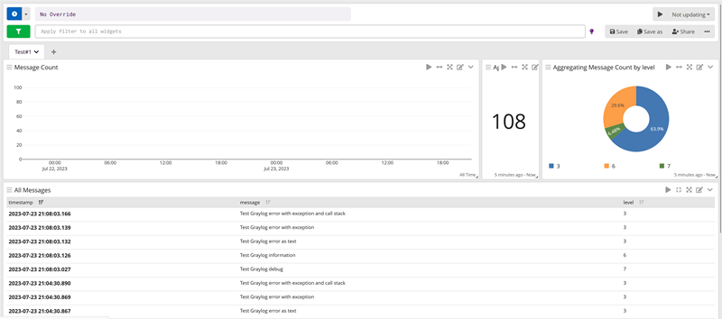
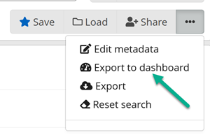
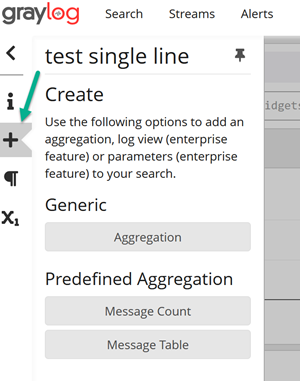
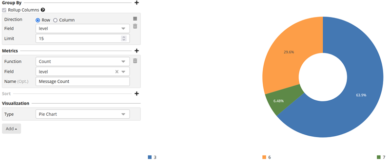
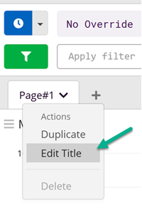

# Graylog
## Overview
If you only have one desktop application then using file logging is not a bad idea.
But if you have a lot of application on different computers then it will be not so easy to look into file based logs for every application.
The better solution is to use a single location for all application logs.
One of the solutions is Graylog software - it centrally captures, stores, and allowed real-time search and log analysis.
You can use most of the standard loggers with extensions for sending log stream. Don't forget that every log message could have more that one additional properties,
like  - app_name="My_Great_application". It will be easy to use this properties for messages search.


## Run graylog locally
For testing purpose you can simply run graylog locally, installing on docker with docker compose.
As long it is running, add GELF tcp and GELF udp inputs.

For windows installation and personal account you can do the next steps:

1. Install Docker desktop software and reboot computer.
2. Create work folder and write here file docker-compose.yml with this content
  
```
  version: '3'
  services:
# MongoDB: https://hub.docker.com/_/mongo/
    mongo:
      image: mongo:5.0.13
      networks:
        - graylog
# Elasticsearch: https://www.elastic.co/guide/en/elasticsearch/reference/7.10/docker.html
    elasticsearch:
      image: docker.elastic.co/elasticsearch/elasticsearch-oss:7.10.2
      environment:
        - http.host=0.0.0.0
        - transport.host=localhost
        - network.host=0.0.0.0
        - "ES_JAVA_OPTS=-Dlog4j2.formatMsgNoLookups=true -Xms512m -Xmx512m"
      ulimits: 
        memlock: 
         soft: -1
         hard: -1
      deploy:
        resources:
          limits:
            memory: 1g
      networks:
        - graylog
# Graylog: https://hub.docker.com/r/graylog/graylog/
    graylog:
      image: graylog/graylog:5.0
      environment:
# CHANGE ME (must be at least 16 characters)!
      - GRAYLOG_PASSWORD_SECRET=somepasswordpepper
# Password: admin
      - GRAYLOG_ROOT_PASSWORD_SHA2=8c6976e5b5410415bde908bd4dee15dfb167a9c873fc4bb8a81f6f2ab448a918
      - GRAYLOG_HTTP_EXTERNAL_URI=http://127.0.0.1:9000/
      entrypoint: /usr/bin/tini -- wait-for-it elasticsearch:9200 --  /docker-entrypoint.sh
      networks:
        - graylog
      restart: always
      depends_on:
        - mongo
        - elasticsearch
      ports:
# Graylog web interface and REST API
      - 9000:9000
# Syslog TCP
      - 1514:1514
# Syslog UDP
      - 1514:1514/udp
# GELF TCP
      - 12201:12201
# GELF UDP
      - 12201:12201/udp
  networks:
    graylog:
      driver: bridge
```

3. Run command docker-compose up
4. Open url http://localhost:9000 and login with user `admin` and password `admin`
5. Setup inputs. We need GELF format.



## General usage with C# application
I'd like to use serilog as only one logger provider, for that case you can use GraylogGelf sink.
It is possible to use serilog as additional logging provider for microsoft logging,
for that case you need to use `AddSerilog()` not `UseSerilog()`.
For test you can run one of the sample application. Then you will see something like this:

<figure>
  
  <figcaption>pic.1</figcaption>
</figure>

## UI setup
On the search page (pic.1) you could find some areas:
1. Timeline settings
2. Query line
3. Bar chart - messages per time interval (not working for `All time`)
4. Messages table title
5. Message line

If you click on message line (5) you can see additional properties:

If you click on title menu triangle you can add this property as table column.
If you click on text menu triangle you can add this text as query filter.

It is possible to edit messages table too

You can add or delete fields and change field order with drag&drop. It is possible to minimize table if we disable show messages in additional row

It is possible to store/load table settings

### How to create a dashboard
If you want to see a little bit more as text table then try to create a dashboard.

For start, export your table as dasboard.

Then you can add additional dashborad parts and arrange its wirg drag&drop (left upper corner with 3 small lines)

For pie chart you need to create `Group By` and `Metrics` for the same field.

You can edit dashboard title too



## Additional information

https://go2docs.graylog.org/5-0/downloading_and_installing_graylog/docker_installation.htm

If you want to build components itself, you can use this command:
docker pull docker.elastic.co/elasticsearch/elasticsearch:8.8.2
https://jinnabalu.medium.com/elasticsearch-on-docker-b7854f116062

https://hub.docker.com/r/opensearchproject/opensearch
docker pull opensearchproject/opensearch

How to find containers IPs: docker network inspect bridge

