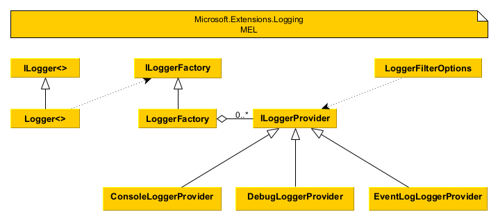
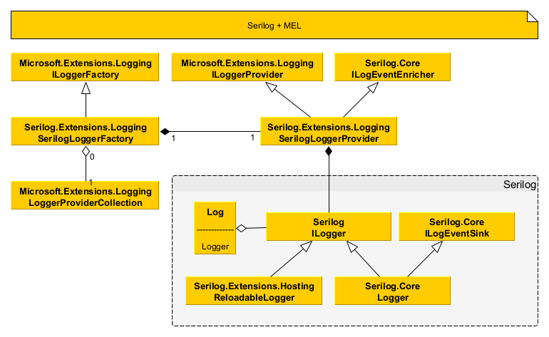
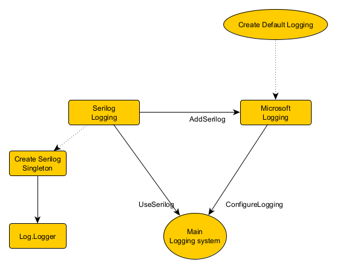
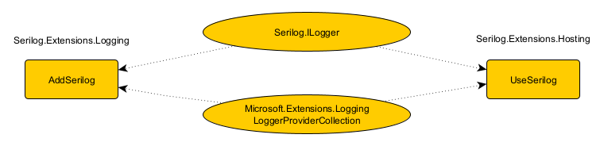
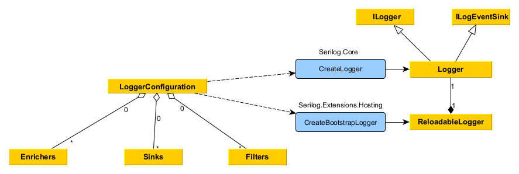

# How To use Serilog
## Overview
Serilog is a diagnostic logging library for .NET applications. It is easy to set up, has a clean API, and runs on all recent .NET platforms. While it's useful even in the simplest applications, Serilog's support for structured logging shines when instrumenting complex, distributed, and asynchronous applications and systems.

There are no exact definition how you must setup and use serilog. It depends of software type and developer preferenced it is possible to use a lot of different combinations. You need to understood logging concept first.

## Serilog Sinks
Sinks are how you direct where you want your logs sent. The most popular of the standard sinks are the File and Console targets.

## Serilog Enrichers
With enrichers you can add additional log properties. It could be: thread id, class name, Machine name and so on.

## Microsoft.Extensions.Logging (MEL)
If you use microsoft .NET application you will have automatically configured logging. It is exists of implementation of `ILogerFactory` and implementations of `ILoggerProvider`  


ILoggerFactory could have more that one ILoggerProvider.
It is possible to add custom logging provider like serilog.

## Serilog

Serilog could be used as standalone logging provider with `Log.Logger` and `ILogger logger = Log.ForContext<ClassName>();`.
With `Serilog.Extensions.Logging` package Serilog can use MEL interfaces, which is why it can be used in conjunction with MEL.

As you can see the concept is slightly different. MEL uses LoggerProvider for each output type, while Serilog uses sink.
Something that you may not have known, with Serilog you can use the same providers as with MEL, but you can only add it from the source code (not from the config file).

## Setting main logger provider
In .NET Core, by default, if you do nothing, MEL will be the default logging system.


You can add serilog to application in different ways: as additional provider to MEL (`AddSerilog`), as single serilog provider (`UseSerilog`) or as standalone serilog logger (`Log.Logger = ...`).


You can call serilog from application in different ways too:
 - as injectable `ILogger<ClassName> logger`
 - as injectable `ILoggerFactory loggerFactory`, `ILogger<ClassName> logger = loggerFactory.CreateLogger<ClassName>();`
 - as class member `Serilog.ILogger _logger = Log.ForContext<ClassName>();`

In all casses will be used context as `ClassName`

## Configuration
Serilog is immutable by default. This mean that you cannot change settings after initialization. From other side you cannot initialize serilog immediately after program beginning as some services are not initialized (like configuration service). If you want to have logging immediately after program beginning you need to use two steps initialization:
1. LoggerConfiguration with CreateBootstrapLoggger() and source code initialization like:
```
var bootstrapSerilogLogger = new LoggerConfiguration()
    .MinimumLevel.Debug()
    .WriteTo.Console()
    .CreateBootstrapLoggger()
```
> **Note**: CreateBootstrapLoggger could be found into `Serilog.Extensions.Hosting` package

2. LoggerConfiguration with CreateLoggger() where all parameters could be read from current configuration:

```
var configuration = new ConfigurationBuilder()
                .SetBasePath(Directory.GetCurrentDirectory()) //  Microsoft.Extensions.Configuration.FileExtensions
                .AddJsonFile("appsettings.json") // Microsoft.Extensions.Configuration.Json
                .Build();

Log.Logger = new LoggerConfiguration()
                .ReadFrom.Configuration(configuration)
                .CreateLogger();
```

> **Note 1**: Configuration extension method could be found into  package. [`Serilog.Settings.Configuration`](https://github.com/serilog/serilog-settings-configuration). You can manage reading configuration over serilog too, see link.



[Serilog Example application](https://github.com/serilog/serilog/wiki/Getting-Started#example-application) used generic hosting model. 
```csharp
var builder = await Host.CreateDefaultBuilder(args)

Log.Logger = new LoggerConfiguration()
                .ReadFrom.Configuration(builder.Configuration)
                .CreateLogger();
var app = builder.Build();

//...
```
For .NET hosting model you can use different initialization
```csharp
var builder = WebApplication.CreateBuilder(args);

builder.Host.UseSerilog((hostContext, services, loggerConfiguration) =>
{
   loggerConfiguration.ReadFrom.Configuration(builder.Configuration);
});
var app = builder.Build();

```


Pay attention that you can use serilog as single standalone debugger (_UseSerilog_) or as additional logging provider (_AddSerilog_) to microsoft logging.


## How to enable Serilog’s own internal debug logging
If you are having any problems with Serilog, you can subscribe to it’s internal events and write them to your debug window or a console.

```
Serilog.Debugging.SelfLog.Enable(msg => Debug.WriteLine(msg));
```
or

```
Serilog.Debugging.SelfLog.Enable(Console.Error);
```

Please note that the internal logging will not write to any user-defined sinks.
## How ASP .NET Core Logging working

As long as you call `Host.CreateDefaultBuilder` system will [initialize Microsoft logger factory](https://learn.microsoft.com/en-us/dotnet/api/microsoft.extensions.hosting.host.createdefaultbuilder) with default logging where you can log to the console, debug, and event source output. 
It is possible to clear all default providers: `builder.Logging.ClearProviders()`

## TIP: Log extra fields on exceptions!
One of the best uses of structured logging is on exceptions. Trying to figure out why an exception happened is infinitely easier if you know more details about who the user was, input parameters, etc.
    
```
try
    {
        //do something
    }
    catch (Exception ex)
    {
        log.Error("Error trying to do something", new { clientid = 54732, user = "matt" }, ex);
    }
```

## Useful links
[Serilog](https://github.com/serilog/serilog)
[Provided Sinks](https://github.com/serilog/serilog/wiki/Provided-Sinks)
[Developing a sink](https://github.com/serilog/serilog/wiki/Developing-a-sink)
[Bootstrap logging with Serilog](https://nblumhardt.com/2020/10/bootstrap-logger/)
[Serilog blog](https://nblumhardt.com/)
[Logging in .NET Core and ASP.NET Core](https://learn.microsoft.com/en-us/aspnet/core/fundamentals/logging/?view=aspnetcore-7.0)
[ASP.NET Core Blazor logging](https://learn.microsoft.com/en-us/aspnet/core/blazor/fundamentals/logging?view=aspnetcore-7.0)
[Serilog Logging in ASP.NET Core](https://referbruv.com/blog/how-to-serilog-logging-in-asp-net-core/)


[Adding a Logger With the .NET 6 Minimal Hosting Model](https://onloupe.com/blog/how-to-config-logger-net6-startup/)
[Bootstrap logging with Serilog + ASP.NET Core](https://nblumhardt.com/2020/10/bootstrap-logger/)